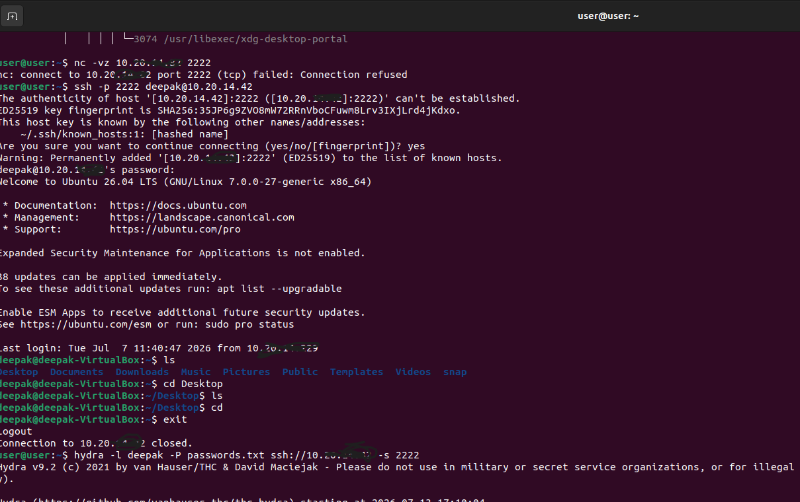
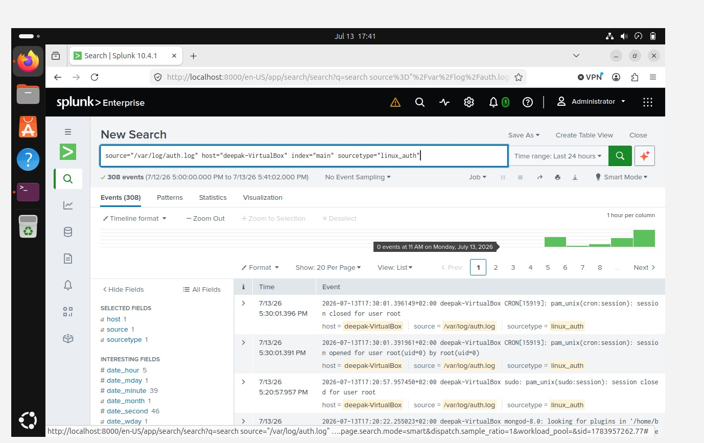
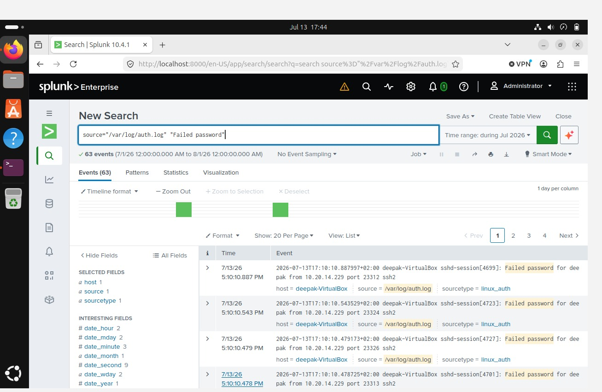
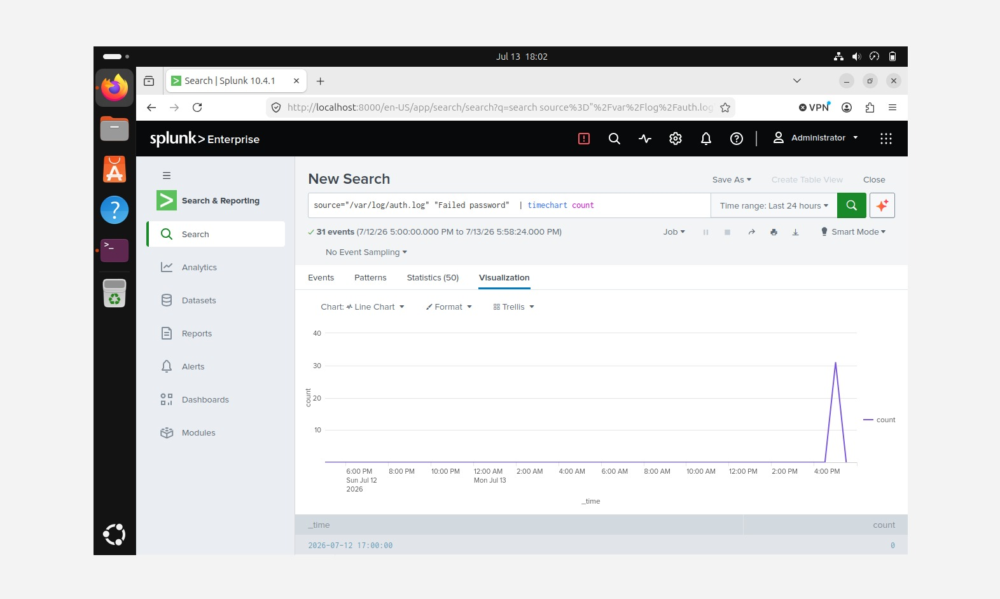

# Project 01 – SSH Brute Force Detection using Splunk

## Project Overview

This project demonstrates how Splunk Enterprise can be used to detect SSH brute-force attacks against a Linux system. A password guessing attack was simulated using Hydra, Linux authentication logs were collected from `/var/log/auth.log`, and Splunk Search Processing Language (SPL) was used to identify malicious authentication attempts.

The goal of this project is to demonstrate the complete SOC detection workflow, from attack simulation to log analysis, visualization, and investigation.

---

## Objectives

- Simulate an SSH brute-force attack
- Collect Linux authentication logs
- Ingest logs into Splunk Enterprise
- Detect failed SSH authentication attempts
- Build a dashboard for visualization
- Investigate attack evidence using SPL

---

## Lab Environment

| Component | Details |
|----------|---------|
| SIEM | Splunk Enterprise 10.4.1 |
| Attacker | Ubuntu Linux + Hydra |
| Victim | Ubuntu Linux (OpenSSH Server) |
| Log Source | `/var/log/auth.log` |
| Attack Type | SSH Brute Force |

---

## Lab Architecture

```text
Attacker (Ubuntu + Hydra)
        │
        │ SSH Brute Force
        ▼
Victim Ubuntu VM
(OpenSSH Server)
        │
        │ Authentication Logs
        ▼
Splunk Enterprise
Search • Dashboard • Investigation
```

---

## Attack Simulation

Hydra was used to generate multiple failed SSH login attempts against the target Ubuntu system.

Example command:

```bash
hydra -l <username> -P passwords.txt ssh://<Target-IP> -s 2222
```

The attack generated repeated authentication failures that were recorded in the Linux authentication logs.

---

## Log Collection

Splunk Enterprise was configured to monitor:

```text
/var/log/auth.log
```

Authentication events were successfully indexed, making them available for search and analysis.

---

## Detection Logic

The detection identifies repeated SSH authentication failures by searching Linux authentication logs for failed password events.

Detection indicators include:

- Failed password
- SSH authentication failure
- Target username
- Source IP address
- Event timestamp

---

## SPL Queries

### View authentication logs

```spl
source="/var/log/auth.log"
```

### Detect failed SSH logins

```spl
source="/var/log/auth.log" "Failed password"
```

### Visualize failed login attempts

```spl
source="/var/log/auth.log" "Failed password"
| timechart count
```

---

## Dashboard

A Splunk Classic Dashboard was created to visualize failed SSH login attempts over time, providing analysts with quick visibility into brute-force activity.

---

## Results

The simulated attack generated multiple failed SSH authentication events.

Splunk successfully:

- Collected Linux authentication logs
- Indexed SSH events
- Detected failed login attempts
- Visualized attack activity using dashboards

---

## Skills Demonstrated

- Splunk Enterprise
- SIEM Administration
- Linux Log Analysis
- SSH Monitoring
- SPL Query Development
- Dashboard Development
- Detection Engineering
- Security Event Investigation

---
## Screenshots

### 1. Hydra SSH Brute Force Attack



---

### 2. Authentication Log Ingestion



---

### 3. Failed Password Detection



---

### 4. Splunk Dashboard


## Lessons Learned

- Simulated an SSH brute-force attack in a controlled lab.
- Collected and analyzed Linux authentication logs.
- Built SPL searches to identify failed authentication attempts.
- Created a dashboard for monitoring brute-force activity.
- Gained practical experience with the SOC detection lifecycle.

---

## Future Improvements

- Create automated Splunk alerts for repeated failed logins.
- Correlate failed and successful SSH authentication events.
- Add geolocation and IP reputation enrichment.
- Expand the lab to include additional Linux security log sources.
